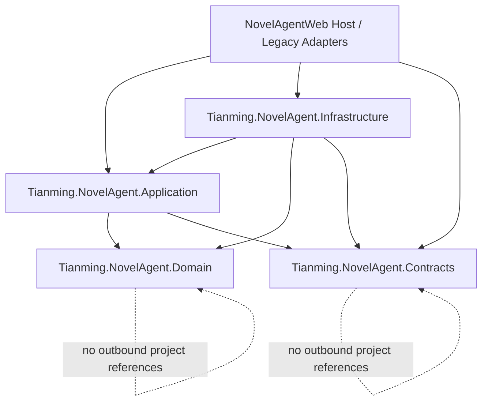

# 小说 Agent 新架构设计

## 1. 设计范围

本设计实现 `prd.md` 锁定的模块化单体架构，把当前 Web 项目中的 Agent 控制面拆到独立程序集，并将 Conversation Agent 与 Production Workflow 分成两个运行时。它们共享稳定合同、上下文、模型网关和事件协议，但不共享执行控制权。

首个纵切面覆盖一个交互批次：会话形成 Proposal，Workflow 确认 Goal，Production 编译并执行单批 DAG，生成 Candidate，等待人工验收，幂等合并 Canon，最后更新 Workflow 投影。

本设计不创建第二套 `v2` Goal/Production 真源，不重写 Canon、Knowledge 或章节存储，也不恢复旧 MissionPlan/Runtime 执行点。

## 2. 架构不变量

1. PostgreSQL 是 Goal、Production、Task、Artifact、Conversation、业务事件和 Canon 的唯一真源。
2. LLM 只产出 Proposal、Artifact 或结构化判断；状态迁移、事务、租约、重试和 Canon 写入由确定性代码决定。
3. Conversation Runtime 不得写 Production、Task 或 Canon。
4. 旧 MissionPlan、NovelAgentOrchestrator、Runtime/ToolExecution 和 legacy Workflow 只能读取和投影。
5. Goal、Production、Task 和 Canon 各有一个写入所有者，跨边界通过命令和持久事件协作。
6. Redis/Qdrant 丢失不会丢失权威状态；SSE 业务重放从 PostgreSQL 的持久 StreamEvent 恢复。
7. Provider SDK、MAF、EF Core 和 Web 类型不能进入 Domain 或 Contracts。
8. 同一项目可以有多个 Proposal/Candidate，但只能有一个 Production 持有有效 Canon 写入租约。

## 3. 项目与依赖边界

新增项目使用以下程序集名称，目录放在仓库 `Agent/` 下：

| 项目 | 职责 | 允许依赖 |
|---|---|---|
| `Tianming.NovelAgent.Domain` | 聚合、值对象、状态机、DAG 不变量、领域事件 | 无项目依赖 |
| `Tianming.NovelAgent.Contracts` | API DTO、命令/查询响应、Event Envelope、Provider-neutral 请求响应 | 无项目依赖 |
| `Tianming.NovelAgent.Application` | Use case、命令处理器、端口、权限与幂等协调 | Domain、Contracts |
| `Tianming.NovelAgent.Infrastructure` | EF Core、PostgreSQL、Outbox、OpenAI Adapter、MAF Adapter、Telemetry | Domain、Contracts、Application |
| `NovelAgentWeb` | Composition Root、REST/SSE、身份适配、旧可靠能力 Adapter | Contracts、Application、Infrastructure；旧代码仅限 Adapter |



`NovelAgentWeb` 不直接引用 Domain。Web Controller 只负责认证主体、传输验证和调用 Application；DI 注册可引用 Infrastructure 的公开注册扩展。

## 4. 双运行时拓扑

```mermaid
flowchart LR
    User["User"] --> ConversationApi["Conversation REST / SSE"]
    ConversationApi --> ConversationRuntime["IConversationAgentRuntime"]
    ConversationRuntime --> Proposal["Decision / Proposal"]
    Proposal --> ProposalStore[("PostgreSQL")]
    Proposal --> Workflow["Workflow confirmation"]
    Workflow --> Goal["Goal Revision"]
    Goal --> Compiler["Typed DAG Compiler"]
    Compiler --> Production["Production State Machine"]
    Production --> Gateway["IModelGateway"]
    Gateway --> Artifact["Candidate / Review Artifact"]
    Artifact --> Acceptance["Human Acceptance"]
    Acceptance --> MergeRequest["Canon Merge Request"]
    MergeRequest --> CanonAdapter["Existing Canon Adapter"]
    CanonAdapter --> Canon[("Canon / Chapter Versions")]
    CanonAdapter --> Projection["Workflow Projection / SSE"]
```



Conversation Runtime 可以读取项目状态、Canon、Knowledge 和已确认决定，但只能通过只读端口。它生成的 Proposal 必须持久化并等待 Workflow 确认。Production Runtime 只消费已确认 Goal Revision 和冻结 Context，不重新解释聊天文本。

## 5. 核心合同

### 5.1 Conversation 合同

- `ConversationSession`：用户、项目、状态、最近持久消息序号和当前 Checkpoint。
- `ConversationMessage`：角色、内容、附件引用、关联 Proposal、创建时间和幂等键。
- `AgentRun`：一次从接受用户输入到 Conversation Agent 安静结束的完整运行，引用冻结的权威 Context Checkpoint、运行状态、安全阀和最后完成的 ModelTurn。
- `ModelTurn`：一次模型调用及其触发的完整工具批次；steering 只能在 ModelTurn 边界注入，恢复点也只建立在完整边界。
- `ConversationDecision`：结构化判断，类型为 `DiscussOnly | ProposeGoal | ProposeRevision | NeedClarification | RejectUnsafe`。
- `GoalProposal`：完整 Goal 合同草案、来源消息范围、摘要、风险、预算和版本哈希。
- `IConversationAgentRuntime`：输入冻结的 `AgentRunContext`，输出 token 流、ModelTurn 事件和最终 `ConversationDecision`；接口不暴露 MAF 类型。
- `IConversationStore`：会话、消息、Proposal、Checkpoint 的权威持久化端口。

`ConversationSession` 是长期连续性边界，不等于一次执行。一个 Session 可以关联多个短生命周期 `AgentRun`，也可以关联多个 Production；Production 的长时间执行不占用或阻塞当前 AgentRun。

只有明确用户意图允许最终 `ConversationDecision` 携带并持久化 Proposal。Agent 可以在自然语言回复中提示“合同已具备形成条件”，但提示本身仍是 `DiscussOnly`，不得自动提升为 Proposal。

### 5.2 Goal 合同

`GoalContract` 是不可变值对象，至少包含目标、模式、章节范围、成功标准、必须保留、必须发生、禁止修改、验收策略、返工策略、预算、风格/模型/协议版本和 Canon/Knowledge 基线。

`GoalRevision` 保存完整快照而不是仅保存补丁，并记录：

- Revision number、schema version 和内容哈希；
- 来源 Session/Proposal；
- 确认者、确认时间和确认命令幂等键；
- 变化原因、受影响范围和上一 Revision；
- 冻结 Context Checkpoint 标识。

### 5.3 Production 合同

- `ProductionMode`：`SingleChapter | InteractiveBatch | AutonomousBook`。
- `Production`：Goal Revision、模式、状态、活动批次、租约、版本和终止原因。
- `ProductionBatch`：章节范围、TaskGraphVersion、Canon baseline、Candidate branch、Checkpoint 和验收状态。
- `KernelTask`：节点类型、输入 Artifact、输出 Schema、依赖、状态、尝试次数、lease、预算和幂等键。
- `KernelArtifact`：不可变内容、Schema、内容哈希、来源任务、模型执行和证据引用。

### 5.4 Application 端口

Application 拥有以下端口；实现位于 Infrastructure 或 Web Legacy Adapter：

- `IGoalRepository`、`IProductionRepository`、`ITaskGraphRepository`、`IArtifactRepository`
- `IConversationStore`、`IStreamEventStore`、`IUnitOfWork`
- `IModelGateway`、`IConversationAgentRuntime`
- `ICanonReadPort`、`ICanonMergePort`、`IKnowledgeReadPort`、`IChapterReadPort`
- `ILegacyProjectSnapshotReader`、`IClock`、`IIdGenerator`、`IUserScope`

## 6. 状态机

### 6.1 Proposal 与 Goal

| 聚合 | 状态 | 允许迁移 |
|---|---|---|
| Proposal | `Draft` | `Proposed`、`Discarded` |
| Proposal | `Proposed` | `Confirmed`、`Rejected`、`Superseded` |
| Goal | `Confirmed` | `Active`、`Cancelled`、`Superseded` |
| Goal | `Active` | `Completed`、`Cancelled`、`Blocked`、`Superseded` |
| Goal | 终态 | 不允许回退；变化创建新 Revision |

确认 Proposal 与创建 Goal Revision 是同一 Application 命令。重复幂等键返回原结果；同一 Proposal 不能确认两次。

### 6.2 Production

| 当前状态 | 命令/事件 | 目标状态 |
|---|---|---|
| `Planned` | `Start` | `Running` |
| `Running` | DAG 到达人工门 | `AwaitingAcceptance` |
| `Running` | `Pause` | `Pausing` |
| `Pausing` | 无 running task | `Paused` |
| `Paused` | `Resume` | `Running` |
| `AwaitingAcceptance` | `AcceptPrefix` | `MergingCanon` |
| `MergingCanon` | `CanonPrefixMerged` | `Running` 或 `Completed` |
| 非终态 | 不可恢复错误 | `Failed` |
| 非终态 | 合同/基线争议 | `Blocked` |
| 非终态 | `Cancel` | `Cancelled` |

`Failed`、`Cancelled` 和 `Completed` 为终态。`Blocked` 只能通过新的 Goal Revision 创建替代 Production，不在原 Production 上改变合同后继续。

### 6.3 KernelTask

`Pending -> Ready -> Leased -> Running -> Succeeded` 是正常路径。可重试失败由 `Running -> Ready`，增加尝试次数并记录退避时间；不可重试失败进入 `Failed` 并由确定性传播规则阻断下游。人工节点使用 `WaitingForHuman`，不能由 worker claim。取消后的未开始节点进入 `Cancelled`，已经返回的迟到结果保存为 `UnadoptedArtifact`。

所有状态机由 Domain 方法和穷举 `switch` 实现；Controller、EF Adapter 和 LLM 输出不能直接设置状态字符串。

## 7. Typed DAG

三种生产模式使用相同节点协议和状态机，`ProductionMode` 只改变编译参数、章节范围和批次继续策略。

首个纵切面的节点骨架：

```text
FreezeContext
  -> AnalyzeRequirements
  -> PlanBatch
  -> CompileChapterContext
  -> WriteCandidate
  -> ReviewContinuity
  -> ReviewLiteraryQuality
  -> AwaitHumanAcceptance
  -> RequestCanonMerge
  -> FinalizeBatch
```

`TaskNodeDefinition` 使用白名单 `TaskKind`、输入 Artifact 类型、输出 Artifact 类型、依赖和重试策略。图编译器必须拒绝循环、缺失依赖、人工节点自动执行、未经过审校即合并以及跨 Goal/Revision 的 Artifact。

第一批只编译一个章节，但测试必须用不同编译参数证明三种模式得到同一节点类型和迁移协议；整书模式暂不要求实际跑完全书。

## 8. 持久化与事务

### 8.1 EF Core 所有权

`Tianming.NovelAgent.Infrastructure` 新建 `AgentControlDbContext`，映射现有 PostgreSQL 的 `creative_goals`、`goal_revisions`、`book_productions`、`production_batches`、`task_graph_versions`、`kernel_tasks`、`kernel_artifacts`、`domain_events` 和 `outbox_events`。不建立语义重复的 `_v2` 表。

新增 Conversation、Proposal、Context Checkpoint 和 StreamEvent 表；对现有表补充确认元数据、Schema/hash、Context freeze、模式和唯一租约所需字段。迁移只能加入 PostgreSQL migrations。

旧 `NovelAgentDbContext` 在切换后仍可读取这些表供 legacy 投影使用，但通过 `LegacyControlPlaneWriteGuard` 拒绝对 Goal、Production、Task、Artifact 和新 StreamEvent 的新增、修改或删除。Canon、Knowledge 和章节的既有合法写入不受该守卫影响。

### 8.2 一般命令事务

每个 Application 命令只修改一个写入聚合，并在同一 `AgentControlDbContext` 事务中写入：

```text
Aggregate state + immutable Artifact + DomainEvent + StreamEvent + OutboxEvent
```

聚合版本用于乐观并发；命令幂等键在用户/项目/命令类型范围内唯一。Outbox claim 使用 PostgreSQL lease 和 `FOR UPDATE SKIP LOCKED`。

### 8.3 Canon 合并握手

新控制面与既有 Canon 服务不跨 DbContext 伪造单事务：

1. `AcceptPrefix` 校验 Production 租约和 Candidate，进入 `MergingCanon`，写 `CanonMergeRequested` Outbox。
2. Web 中的 `LegacyCanonMergeAdapter` 以 request id 作为幂等键，调用既有 `IPrefixMergeService`；Canon 事务负责基线冲突、受保护版本、连续前缀和 merge record。
3. 合并成功发布 `CanonPrefixMerged`；失败发布可分类的 `CanonMergeRejected`。
4. Production 消费结果事件并幂等推进。进程在任一步崩溃都可从 request/merge record 恢复，不会重复合并。

Canon 写入租约由 PostgreSQL 唯一约束和过期时间共同保证，Redis 不能决定租约有效性。

## 9. Context、Checkpoint 与记忆提升

`FrozenContextEnvelope` 包含 Goal Revision、Canon baseline、Knowledge snapshot、Style/Quality/Model/Prompt/Schema/Protocol versions、允许的项目决定和内容哈希。每个任务引用 Envelope id，不保存无法追踪来源的拼接文本。

批次开始时冻结 Envelope；批次内 Candidate 可作为显式分支证据向后传递。Canon 只在成功合并后的批次 Checkpoint 演进，下一批重新冻结。

记忆分层：

- Session message/checkpoint：临时会话上下文；
- Proposal：未确认创作意图；
- Confirmed project decision：已确认但不是作品事实；
- Canon/Knowledge：权威作品事实和有效资料；
- Memory promotion request：从会话提升到项目决定的显式请求。

Conversation Runtime 不得直接完成 memory promotion；确认命令记录操作者和来源。

## 10. Model Gateway 与 Conversation Runtime

Conversation Runtime 采用 Pi 风格的最小 ReAct 内核，但不把该循环扩展到 Production：

```text
AgentRun start -> freeze authoritative Context Checkpoint
  -> drain steering at ModelTurn boundary
  -> one model call
  -> execute the complete tool batch
  -> persist ModelTurn + recovery checkpoint
  -> no tool call / no steering / safety stop -> terminal ConversationDecision
```

运行期间的新用户消息进入 steering 队列，在下一完整 ModelTurn 边界注入；显式停止通过 cancellation signal 取消 AgentRun。不得在模型流式返回中途或工具批次执行中途改写上下文。

每个 AgentRun 使用同一个权威 Context Checkpoint。项目权威状态在运行期间发生变化时，当前 Run 标记为 context stale，并在结束后由新 AgentRun 获取新快照；不得在同一推理链中静默混用两个 Canon/Goal 基线。

崩溃恢复只从已持久化的完整 ModelTurn 边界继续。半截 Token delta 可以丢弃，未形成完整边界的模型调用或工具批次不得被伪装成已完成。MVP 不提供通用 followUp 外层循环；自然结束后必须等待新的用户输入。

### 10.1 Chat Loop 与 Production Workflow 的时延边界

Chat Loop 的目标是快速给出下一步可交互反馈，不是把整个创作任务一次性做完。默认 AgentRun 只允许有限数量的 ModelTurn 和有限工具批次；达到任一时延、预算或上下文阈值时，返回当前结论、待补信息或 `ResearchPending`，由用户决定是否继续。

章节生成、深度检索、多阶段审校和 Candidate 生产必须通过显式 handoff 创建异步 Production Workflow。Conversation Agent 先返回 handoff accepted、Production id 和当前状态，后续进度由 Workflow SSE/查询投影提供；Agent 不在同一聊天请求中同步等待完整 DAG。

Pi 的 ReAct 内核仍可用于一次短 Chat Loop，但“允许模型继续调用工具”必须受到产品级上限约束。内部模型思考 token 的长短不可作为完成标准，业务层只根据 ModelTurn、工具批次、时延、预算和终止状态做安全判断。

### 10.2 ConversationSession 与 Production 的事件握手

长任务采用“同一 Session、多个 AgentRun、持久 Workflow Event”的连接方式：

```text
AgentRun A: 用户请求 -> 短 ReAct -> WorkflowActionRequest -> accepted(productionId) -> AgentRun A 结束
Production:  持久 DAG 异步执行 -> StageCompleted / AwaitingAcceptance / Failed / Cancelled / CanonMerged
Workflow UI: 完整进度、Candidate、错误、操作按钮和可重放事件
AgentRun B: 用户查看/点击/发消息 -> 读取 Workflow Event Context -> 解释或提出下一条命令
```

`Workflow Event` 必须携带 `sessionId`、`productionId`、`correlationId`、事件序号、状态快照引用和用户可见摘要。它同时进入 Workflow Projection 和 ConversationSession 的关联时间线，但不把 Workflow 内部每个节点结果伪装成新的聊天消息。

长任务状态的主呈现面是 Workflow UI：阶段进度、Candidate、失败原因、暂停/恢复/终止和人工验收均在那里完成。Conversation 只显示紧凑的关联卡片或状态摘要，并提供“解释、继续、重试、修订、打开 Workflow”等入口。

MVP 中 Workflow Event 不自动唤醒隐藏的常驻 Agent。用户打开关联卡片或发送新消息时，系统以同一 `ConversationSession` 创建新的 AgentRun，并将相关事件作为只读 `WorkflowEventContext` 注入；只有该 AgentRun 才能生成自然语言解释或新的 `WorkflowActionRequest`。

### 10.3 小说 Agent 工具系统分层

工具系统借鉴 Pi 的三层类型和五步管道，但按小说领域增加稳定原始工具、能力包和 Workflow 隔离：

| 层 | 小说 Agent 责任 | 不应包含 |
|---|---|---|
| `ToolContract` | 名称、描述、输入/输出 Schema、版本、风险、作用域、时延类别、幂等和确认要求 | Provider SDK、UI 组件、未受控系统句柄 |
| `AgentToolRuntime` | 参数预处理、Schema 验证、权限拦截、取消、执行、进度和结构化错误 | 具体页面渲染、绕过资源策略 |
| `ToolDefinition` | 面向模型的说明、面向用户的 label、提示片段、调用/结果渲染和审计标签 | 绕过 Application 写入状态 |
| `CapabilityPack` | 按会话阶段挂载最小工具集合，例如探索、提案、监督、验收 | 一次暴露全部工具 |

#### 10.3.1 稳定原始工具与 Operations

`read`、`write`、`search`、`sql`、`http` 是长期稳定的原始工具合同，允许后续知识库、上下文、记忆和领域工具在其上组合，而不修改原始工具的模型协议。它们不是任意系统调用：

| 原始工具 | 允许的小说 Agent 语义 | 必须禁止 |
|---|---|---|
| `read` | 读取虚拟资源 URI，例如 `project://canon/...`、`knowledge://source/...`、`workflow://production/...`；绑定用户作用域和 Context Checkpoint | 任意本机路径、凭据文件、未授权项目 |
| `write` | 写入临时会话记忆、研究快照、RawSource、DraftArtifact、知识提炼草案或会话附件；通过 Application command 写入受控 memory/knowledge staging | 直接修改 Goal、Production、KernelTask、Canon 或已确认项目记忆/权威知识 |
| `search` | 在授权资源集合中做文本/元数据搜索，并返回来源和版本 | 无范围的全库扫描、绕过 RAG/权限的隐式检索 |
| `sql` | 只读查询经过暴露清单的 PostgreSQL view/read model，带 RLS、超时、行数和成本限制 | 任何 DDL/DML、函数副作用、直接写控制表、绕过 Application owner |
| `http` | 通过出站代理执行受策略约束的 GET/HEAD/受控检索，保存原始响应和来源证据 | 任意 POST/PUT、内网/云元数据访问、携带模型可见凭据 |

原始工具内部再通过最小化 `Operations` 端口访问基础设施，例如 `ReadOperations`、`WriteOperations`、`SearchOperations`、`SqlReadOperations`、`HttpFetchOperations`。Operations 可被测试替换或由不同基础设施实现；工具不得直接调用 EF、文件系统、Worker SQL 或 Provider API。

原始 `write` 只提供受控资源写入能力，不授予聚合写权限。记忆和知识 CRUD 按权威级别分层：

| 数据级别 | 允许的写入方式 | 用户确认 |
|---|---|---|
| Session scratch / temporary memory | ConversationStore 或 staging resource 的追加、覆盖和清理 | 普通会话内可自动执行，受用户作用域和 AgentRun 限制 |
| ResearchArtifact / KnowledgeCandidate / memory draft | 类型化 Application command，保留来源、版本和内容哈希 | 创建草案可按策略自动；推广、修改已确认内容、归档和删除需确认 |
| Confirmed project decision / authoritative Knowledge | `promote_memory`、`promote_knowledge`、`revise_knowledge` 等幂等命令 | 必须用户确认；不能由 `write`、`sql` 或 Qdrant 直接完成 |

Qdrant、全文索引和 RAG cache 只接受由 PostgreSQL 权威变更触发的派生更新；模型不能直接增删改向量记录。查询仍可通过 `search`/受控只读 `sql` 或 `KnowledgeRetrievalPort` 完成。

领域组合工具在 Application 层调用这些原始 Operations 或受控原始工具服务，不通过模型递归调用另一个工具。这样可以在不改变 `read/write/search/sql/http` 合同的前提下增加 RAG、记忆、知识提炼和小说领域工具。

Conversation Agent 的首批能力包建议如下：

| 能力包 | 模型可见能力 | 语义 |
|---|---|---|
| `ProjectExploration` | 受控 `read`、`search`、只读 `sql`，以及由它们组合的 `read_project_snapshot`、`search_knowledge`、`search_decisions`、`read_artifact` | 只读、绑定 AgentRun 的冻结 Context |
| `ProposalDrafting` | 上述读取能力 + `preview_goal_revision`、`preview_production` | 只生成草案/预览，不写 Goal 或 Production |
| `WorkflowHandoff` | `get_production_status`、`request_start_production`、`request_revision` | 粗粒度异步请求，返回 `accepted + productionId`，不等待 DAG |
| `WorkflowSupervision` | `get_production_status`、`read_candidate`、`request_pause`、`request_resume`、`request_cancel` | 命令经 Application 状态、权限、幂等和确认门校验 |
| `Acceptance` | `read_candidate_diff`、`request_accept_prefix`、`request_revision` | 只请求人工验收/合并，不直接写 Canon |
| `ExternalResearch` | `search`、受控 `http`、`write` 到 RawSource/DraftArtifact、`read` 原始响应 | 外部资料只形成带来源的研究材料，不自动成为权威知识 |
| `MemoryKnowledge` | `search`/只读 `sql` 查询记忆与知识；`write` 仅写 staging；`promote_memory`、`promote_knowledge`、`revise_knowledge` 等类型化命令 | 权威推广、修改、归档和删除必须经用户确认 |

以下内容不注册为 Conversation Agent 的普通工具：`WriteCandidate`、`ReviewContinuity`、`ReviewLiteraryQuality`、`CanonMerge`、`KernelTask claim/renew`、租约 SQL、任意 Bash 或文件系统写入。它们属于 Production DAG 的节点执行器或人工/管理员界面；可以复用 Operations 和错误管道，但必须拥有独立的 Worker registry、执行上下文和状态所有者。

#### 10.3.2 知识库与 RAG 管线

知识系统采用“原始来源 → 提炼候选 → 推广状态 → 检索派生”的单向管线：

```text
用户上传 / http 外部检索 / Agent 研究
  -> RawSource + ResearchArtifact（不可变、带 provenance/hash）
  -> parse / normalize / extract / summarize
  -> KnowledgeCandidate + citations
  -> user/policy promotion
  -> KnowledgeItem（PostgreSQL 权威版本）
  -> embedding / full-text / rerank index（Qdrant 等可重建派生）
  -> KnowledgeRetrievalPort
  -> Conversation Agent 或 Production DAG 的冻结 Context
```

用户上传、外部检索和 Agent 自主研究都使用同一来源合同；“总结”与“权威知识”不是同一状态。RAG 返回必须带知识版本、来源引用、权威级别和适用范围。清空 Qdrant 后，索引可从 PostgreSQL 的 KnowledgeItem 和持久 RawSource 重建。

工具调用仍遵循 Pi 的五步管道：`prepareArguments -> validate -> beforeToolCall(policy/permission) -> execute -> afterToolCall(redaction/audit/render)`。任何失败都编码为带 `code`、`retryable`、`userAction` 和安全详情的 `ToolResult`；工具内部应识别已知错误，框架负责未知异常兜底。只读同快照查询可并行，命令和有副作用操作默认串行；`request_start_production` 等异步命令完成的是“受理”，不是生产结果。

`IModelGateway` 接收 Provider-neutral `ModelRequest`：用途、消息/输入、结构化 Schema、工具声明、模型策略、预算、Context hash、Prompt/Schema version 和 Trace context。返回标准化 `ModelResult`、usage、provider request id、finish reason、tool calls 和结构化错误。

Infrastructure 提供：

- `OpenAIResponsesModelAdapter`：使用官方 OpenAI .NET SDK 和 Responses API；SDK 类型仅存在于该项目。
- `LegacyWritingModelAdapter`：通过 Web Adapter 包装当前 `IWritingModelCompletionService`，作为非 OpenAI Provider 的迁移桥，不成为长期领域合同。
- Provider capability registry：显式声明 structured output、streaming、tool calling、idempotency query 和 usage 能力。

每次调用先持久化 `ModelExecution` 和预算预留，再调用 Provider；结果、usage、延迟、fallback、Context hash 和 Trace 持久化。`OutcomeUnknown` 不自动当失败释放预算。

`MafConversationAgentRuntime` 实现 `IConversationAgentRuntime`，但 MAF 的 Agent、Thread、Message、Tool 和 Checkpoint 类型全部在 Adapter 内转换。测试使用 `DeterministicConversationAgentRuntime` 替换 MAF，证明 Domain、Application 和数据库模型不变。

MAF 和 OpenAI SDK 的具体包版本在实现前兼容性探针中锁定；不得为追逐预览 API 修改 Domain 合同。

## 11. 事件与 SSE

公共 `AgentEventEnvelope<T>` 包含：

```text
eventId, streamKind, streamId, sequence, eventType, schemaVersion,
occurredAt, correlationId, causationId, projectId,
sessionId?, goalId?, productionId?, data
```

`streamKind` 为 `conversation` 或 `workflow`。同一 stream 的 `sequence` 单调递增；客户端按 `eventId + sequence` 去重。Envelope 不包含凭据、完整 Prompt 或未授权用户标识。

- 业务事件：事务写入 PostgreSQL `stream_events` 与 Outbox，可按游标重放。
- Token delta：通过内存/Redis live channel 发布，标记 `transient=true`，不写 Outbox，也不参与恢复。
- 重连：`Last-Event-ID` 解析为持久游标；过期游标返回稳定错误和最新查询快照入口，不静默跳过。
- Conversation SSE 和 Workflow SSE 使用不同授权资源和端点，不能通过一个 session 订阅项目全部 Workflow 事件。

## 12. Web API 与 Adapter

建议的首个纵切面端点：

```text
POST /api/agent/conversations/{sessionId}/turns
POST /api/agent/proposals/{proposalId}/confirm
POST /api/agent/productions/{productionId}/commands/{command}
GET  /api/agent/workflows/projects/{projectId}
GET  /api/agent/streams/conversations/{sessionId}
GET  /api/agent/streams/workflows/{projectId}
```

Controller 从认证主体取得 user id，验证 ownership，将 DTO 转为 Application 命令。Web 中允许存在的旧能力 Adapter 仅包括 Canon、Knowledge、Chapter、Legacy snapshot 和迁移期模型桥；Adapter 不持有新状态机。

旧 Workflow 投影继续显示 `projectionKind=legacy` 和 `legacy_read_only`。新查询只组合 read model，不把 legacy run 映射为新 Production。恢复命令读取正式内容和已确认决定，创建新的 Proposal/Goal。

## 13. 可观测性与安全

- 每个 Conversation turn、Proposal、Goal command、Production、Task、ModelExecution、Canon merge request 使用同一 correlation chain。
- OpenTelemetry 覆盖 REST、SSE 建连、Application command、EF transaction、Outbox、worker、Provider 调用和 Canon Adapter。
- 日志只记录标识、版本、hash、状态、耗时和用量；不记录 API key、JWT、完整正文、完整 Prompt 或知识原文。
- API、SSE、worker 和 Outbox consumer 都必须建立权威用户作用域；客户端 user id 不参与授权。
- Prompt/Schema 和 Event Envelope 具有显式版本；未知版本拒绝处理，不做自由 JSON 猜测。

## 14. 迁移与切换

采用同仓库绞杀迁移，但不长期双写：

1. 建立 `.NET 10` toolchain、新项目和架构依赖测试。
2. 建立 Domain/Contracts/Application 和新 DbContext，对现有控制表做兼容迁移。
3. 接入 Conversation Proposal 与 Goal 确认命令，旧会话入口改为 Adapter。
4. 接入单批 Production、Task worker、Candidate 和 Canon 合并握手。
5. Web Workflow 查询切到新 read model，同时保留 legacy read-only 分区。
6. 启用旧控制面写入守卫，删除旧 DI 写入口；监测期内保留只读审计。
7. 达到删除门槛后再独立删除旧 Orchestrator/Runtime 写代码，不在首个纵切面中物理清除。

切换禁止 Goal/Production 双写。若新路径失败，回滚 Web 路由和新 worker，保留新表/列与审计数据；不得把已开始的新 Production 转回旧 MissionPlan 执行。

## 15. 测试策略

- Domain 单元测试：所有状态迁移、非法迁移、DAG 循环/缺依赖、租约和 protected Canon 规则。
- 架构测试：程序集引用、命名空间和 Provider SDK 泄漏；Web Controller 不能引用 DbContext/Domain 聚合。
- Application 契约测试：Conversation 只能形成 Proposal，确认幂等，写入所有者唯一。
- PostgreSQL Testcontainers：事务、并发版本、lease、Outbox、stream sequence、RLS、崩溃恢复和 Redis/Qdrant 可重建语义。
- Adapter 契约测试：MAF 可替换、OpenAI 响应映射、legacy Canon merge 幂等和基线冲突。
- SSE 测试：断线重放、重复事件、过期游标、两个 stream 隔离和 token delta 非持久化。
- Playwright：从聊天 Proposal 到 Workflow 验收/合并的首个纵切面。

## 16. 主要取舍

- 选择持久 Typed DAG 而非 LangGraph/Temporal：当前需要领域可审计性和单库事务，尚无必须引入外部编排器的规模证据。
- 选择事件握手而非跨 DbContext 共享事务：Canon 保持唯一写入所有者，失败可恢复且 Adapter 可替换。
- 选择映射现有 Goal/Production 表而非新建 `v2` 表：避免双真源；代价是迁移期需要写入守卫和兼容字段迁移。
- 选择持久 StreamEvent 与 Outbox 分离：Outbox 负责投递，StreamEvent 负责用户可见重放，避免清理 Outbox 后丢失 SSE 历史。
- 选择全后端升级 `.NET 10`：`net8.0` Web 无法直接引用 `net10.0` Application；多目标会延长双栈并削弱隔离目标。

## 16.1 迁移期 Worker ownership 说明

目标决策没有改变：`AgentControlDbContext` 是新控制面的 Goal、Production、Task、Artifact 和新业务事件写入 owner；旧 MissionPlan、Orchestrator 和 Runtime 不能成为新执行模型的 owner。

当前实现存在一个明确的迁移期例外：旧 Web 托管的 `KernelTaskWorker` 仍通过 `PostgresKernelTaskScheduler` 使用 `NovelAgentDbContext` 完成共享 `kernel_tasks` 状态和 `novel_agent_acceptance_gate_reached` Outbox 写入。该例外的边界是：

- 它只负责已经编译任务的 claim/complete/fail/renew 和 acceptance-gate bridge，不创建 Goal、Proposal 或新的 Canon 事实。
- bridge consumer 在新 Application 中重新校验 user/project/goal/graph/task/dependency/batch/branch，再推进 `ProductionAwaitingAcceptance`；重复投递必须幂等。
- `EnforceLegacyControlPlaneReadOnly=false` 是迁移未完成的显式信号，不是最终安全配置；不能据此宣称 AC-8 已通过。
- 在启用 legacy write guard 前，必须把 scheduler 的任务写入、失败状态推进和相关 migration function 迁移到 AgentControl owner，或形成经过批准且可证明不越权的独立 worker adapter；不得通过 raw SQL 或 scoped bypass 绕过守卫。

这是一条迁移边界记录，不是长期双写决策。下一纵切面的完成条件是：同一真实 Worker 从新控制面 claim 到 acceptance bridge 的 Testcontainers 证据、失败/租约路径的单一写入口，以及 guard 默认启用后的回归测试。

## 17. 实现前必须验证的技术项

- 本机目前仅安装 `.NET SDK 8.0.127`；启动实现前必须安装并锁定可用的 `.NET 10 SDK`，然后验证全部现有项目升级。
- 锁定与 `.NET 10` 兼容的 EF Core/Npgsql、OpenAI .NET SDK、MAF、Testcontainers 和测试包版本。
- 核实现以官方 SDK 实际公开 API 为准；若 MAF 仍为预览或无法满足替换测试，保留接口并使用薄 Adapter，不改变领域模型。
- 确认现有 PostgreSQL migration history 对新 `AgentControlDbContext` 的所有权方案；禁止两个 migration assembly 同时管理同一表。
