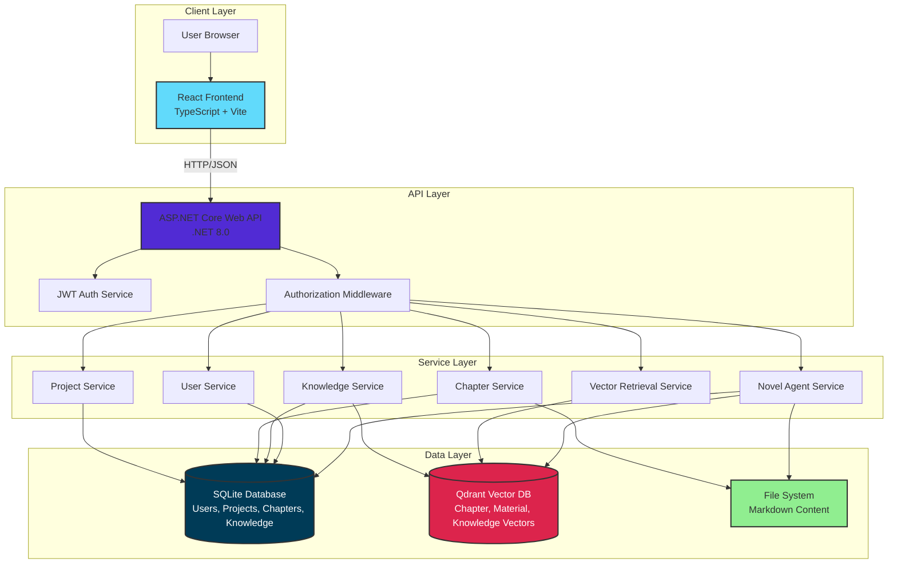

# Architecture Overview

This document provides a comprehensive architecture overview of the Tianming Agentic Novel Studio multi-user system.

## System Architecture



## Technology Stack

### Frontend
- **Framework**: React 19.2
- **Language**: TypeScript 6.0
- **Build Tool**: Vite 8.0
- **State Management**: Zustand 5.0
- **Data Fetching**: TanStack Query 5.101
- **Routing**: React Router 7.17
- **Styling**: CSS Modules

### Backend
- **Framework**: ASP.NET Core 8.0
- **Language**: C# 12
- **ORM**: Entity Framework Core 8.0
- **API Pattern**: RESTful
- **Authentication**: JWT (JSON Web Tokens)
- **Database**: SQLite 3

### Infrastructure
- **Vector Database**: Qdrant 1.8.0
- **Container Runtime**: Docker 24+
- **Orchestration**: Docker Compose 2+
- **Reverse Proxy**: (Nginx recommended for production)

## Data Architecture

### Database Schema (SQLite)

```
┌─────────────┐         ┌──────────────┐         ┌──────────────┐
│   Users     │         │   Projects   │         │   Chapters   │
├─────────────┤         ├──────────────┤         ├──────────────┤
│ Id (PK)     │───┐     │ Id (PK)      │───┐     │ Id (PK)      │
│ Username    │   └────<│ UserId (FK)  │   └────<│ ProjectId(FK)│
│ PasswordHash│         │ Title        │         │ Title        │
│ Email       │         │ Genre        │         │ ContentPath  │
│ CreatedAt   │         │ CoreHook     │         │ ChapterNumber│
│ UpdatedAt   │         │ UpdatedAt    │         │ CreatedAt    │
└─────────────┘         └──────────────┘         │ UpdatedAt    │
                                                  └──────────────┘
                                                         │
                        ┌────────────────────────────────┘
                        │
                        ↓
              ┌──────────────────┐
              │  Foreshadows     │
              ├──────────────────┤
              │ Id (PK)          │
              │ ProjectId (FK)   │
              │ ChapterId (FK)   │
              │ Name             │
              │ Status           │
              │ SetupChapterId   │
              │ PayoffChapterId  │
              │ CreatedAt        │
              │ UpdatedAt        │
              └──────────────────┘

┌──────────────────┐         ┌──────────────────┐
│ CharacterLedgers │         │  CanonLedgers    │
├──────────────────┤         ├──────────────────┤
│ Id (PK)          │         │ Id (PK)          │
│ ProjectId (FK)   │         │ ProjectId (FK)   │
│ ChapterId (FK)   │         │ ChapterId (FK)   │
│ CharacterName    │         │ EventType        │
│ State            │         │ Content          │
│ Goals            │         │ Timestamp        │
│ Secrets          │         │ CreatedAt        │
│ CreatedAt        │         │ UpdatedAt        │
│ UpdatedAt        │         └──────────────────┘
└──────────────────┘
```

### Vector Storage (Qdrant)

```
Collection: project_{projectId}
├── Vector Dimension: 512
├── Distance Metric: Cosine
└── Payload Schema:
    ├── chapterId: string
    ├── title: string
    ├── content: string
    ├── order: int
    └── metadata: object
```

### File System Structure

```
App_Data/
├── Database/
│   └── novelagent.db
├── Qdrant/
│   └── [vector storage]
└── Projects/
    └── {ProjectName}/
        ├── NovelProjects/
        │   └── projects.json
        ├── Services/
        │   └── Framework/
        │       └── AI/
        │           └── NovelAgent/
        │               ├── creative_knowledge_base.json
        │               ├── story_bible.json
        │               └── volume_arcs.json
        └── Agent/
            └── sessions.json
```

## API Architecture

### Authentication Flow

```
1. User Registration/Login
   POST /api/auth/register
   POST /api/auth/login
   ↓
2. Server validates credentials
   ↓
3. Server generates JWT token
   ↓
4. Client stores token (localStorage)
   ↓
5. Client includes token in Authorization header
   Authorization: Bearer {token}
   ↓
6. Middleware validates token on each request
   ↓
7. CurrentUserService provides user context
```

### Authorization Model

- **User Isolation**: Each user can only access their own projects
- **Data Filtering**: Database queries filtered by UserId
- **Collection Isolation**: Qdrant collections per project
- **File Access**: Path validation prevents directory traversal

### API Endpoints

#### Authentication
- `POST /api/auth/register` - Register new user
- `POST /api/auth/login` - Login and get JWT token

#### Projects
- `GET /api/project?pageNumber=1&pageSize=20` - List user's projects
- `POST /api/project` - Create new project
- `GET /api/project/{id}` - Get project details
- `PUT /api/project/{id}` - Update project
- `DELETE /api/project/{id}` - Delete project

#### Workspace And Workflow
- `GET /api/workspace` - List workspace project overviews and statistics
- `GET /api/workflow/project/{projectId}` - Get one project's workflow detail
- `GET /api/workflow/volumes?projectId={projectId}` - List project volumes
- `POST /api/workflow/volumes` - Create a volume

#### Chapters
- `GET /api/chapters/project/{projectId}` - List chapters
- `POST /api/chapters` - Create chapter
- `GET /api/chapters/{id}` - Get chapter details
- `PUT /api/chapters/{id}` - Update chapter
- `DELETE /api/chapters/{id}` - Delete chapter

#### Knowledge And Retrieval
- `GET /api/knowledge?projectId={projectId}` - List project knowledge entries
- `POST /api/knowledge` - Create knowledge entry
- `POST /api/knowledge/search` - Search project knowledge entries
- `POST /api/knowledge/upload` - Upload a knowledge source file
- `GET /api/knowledge/tasks/{taskId}` - Check processing task status

Current local retrieval uses the in-repository BGE embedding runtime by default.
Redis, Qdrant, SQLite, and the outbox vectorization pipeline are part of the
normal production path; deterministic stub embeddings are not a supported
compatibility mode.

#### Novel Agent
- `POST /api/agent/chat` - Send a chat/agent message
- `GET /api/agent/sse/{sessionId}` - Stream agent events
- `GET /api/agent/session/{sessionId}` - Get session details
- `GET /api/agent/sessions` - List agent sessions
- `POST /api/agent/session` - Create an agent session

## Service Architecture

### NovelAgent Core

```
┌─────────────────────────────────────────────────┐
│         NovelAgent Orchestrator                 │
├─────────────────────────────────────────────────┤
│  - Story Foundation (Canon, Rules, Promises)    │
│  - Volume Planning (Acts, Arcs, Pacing)         │
│  - Chapter Planning (Candidates, Beat Sheets)   │
│  - Content Generation (Prose, Dialogue)         │
│  - Post-Reflection (Quality Check, Ledger)      │
└─────────────────────────────────────────────────┘
                       ↓
┌─────────────────────────────────────────────────┐
│         Ledger Management                       │
├─────────────────────────────────────────────────┤
│  - Foreshadow Ledger (Planned → Paid Off)       │
│  - Character Ledger (Goals, Secrets, State)     │
│  - Canon Ledger (Events, Timeline, Truth)       │
└─────────────────────────────────────────────────┘
                       ↓
┌─────────────────────────────────────────────────┐
│         RAG (Retrieval-Augmented Generation)    │
├─────────────────────────────────────────────────┤
│  - Vector Search (Similarity, Context)          │
│  - Knowledge Base (Story Bible, Rules)          │
│  - Creative Constraints (Genre, Style)          │
└─────────────────────────────────────────────────┘
```

### Agent Workflow

```
User Input
    ↓
Story Foundation
    ↓
Volume Planning
    ↓
Chapter Candidates (Multiple)
    ↓
User Selection
    ↓
Chapter Generation
    ↓
Post-Reflection
    ↓
Ledger Update
    ↓
Vector Embedding
    ↓
Next Chapter (Loop)
```

## Security Architecture

### Authentication
- **JWT Tokens**: Stateless authentication
- **Password Hashing**: BCrypt with salt
- **Token Expiry**: 7 days (configurable)
- **Secure Storage**: HttpOnly cookies (recommended for production)

### Authorization
- **Claim-Based**: User identity from JWT claims
- **Resource Ownership**: Database-level filtering
- **Middleware**: Global authorization enforcement
- **Scope Isolation**: Per-project vector collections

### Data Protection
- **SQL Injection**: EF Core parameterized queries
- **XSS Prevention**: React automatic escaping
- **CSRF Protection**: Token validation
- **Path Traversal**: Validated file paths

## Performance Architecture

### Caching Strategy
- **Client-Side**: TanStack Query cache (5 minutes)
- **Server-Side**: EF Core query result cache
- **Static Assets**: Browser cache (1 year for versioned files)

### Database Optimization
- **Indexes**: Primary keys, foreign keys, UserId
- **WAL Mode**: Write-Ahead Logging for concurrency
- **Connection Pooling**: Reuse database connections
- **Lazy Loading**: Disabled (explicit includes)

### Vector Search Optimization
- **Batch Operations**: Bulk inserts (100 vectors)
- **gRPC Protocol**: Lower latency than REST
- **Collection Sharding**: Per-project isolation
- **HNSW Index**: Fast approximate nearest neighbor

## Deployment Architecture

### Development
```
localhost:3002 (Vite Dev Server)
    ↓
localhost:5002 (ASP.NET Core)
    ↓
localhost:6333 (Qdrant REST)
localhost:6334 (Qdrant gRPC)
```

### Production (Recommended)
```
User
  ↓
Nginx (HTTPS, Load Balancer)
  ↓
ASP.NET Core (Multiple Instances)
  ↓
SQLite (or PostgreSQL for scale)
Qdrant (Docker or Qdrant Cloud)
```

## Scaling Considerations

### Current Limitations
- **SQLite**: Single-writer limitation
- **File Storage**: Local disk only
- **Single Instance**: No horizontal scaling

### Migration Path
1. **PostgreSQL**: Replace SQLite for multi-writer support
2. **Redis**: Add distributed cache and session store
3. **S3/Blob Storage**: Move files to cloud storage
4. **Load Balancer**: Deploy multiple backend instances
5. **Qdrant Cluster**: Scale vector search

## Monitoring and Observability

### Logging
- **Structured Logs**: JSON format
- **Log Levels**: Debug, Info, Warning, Error
- **Log Sinks**: Console, File, External (Seq, ELK)

### Metrics
- **API Response Times**: p50, p95, p99
- **Database Query Performance**: Slow query log
- **Vector Search Latency**: Qdrant metrics
- **Error Rates**: By endpoint and error type

### Health Checks
- `GET /health` - Backend health
- `GET /health/db` - Database health
- `GET /health/qdrant` - Vector database health

---

**Last Updated:** 2026-06-08
