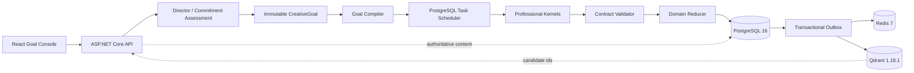

# 天命小说 Agent 架构

**状态：** 已实施并通过全量验收
**更新时间：** 2026-07-31
**Agent Loop 基线：** `Docs/AGENT_CORE_ARCHITECTURE.md`（2026-08-22 起，Core-first 分层权威）
**完整规范：** `Docs/superpowers/specs/2026-07-12-novel-agent-target-architecture.md`（已降级为历史整合计划）
**验收记录：** `Docs/superpowers/tests/2026-07-13-novel-agent-target-architecture-acceptance.md`

本文是当前生产架构入口。旧的 SQLite、文件正文、通用 ReAct 小说生产 loop 和平级业务工具编排均不再是生产路径。

## 1. 架构原则

1. PostgreSQL 是用户、项目、正文、知识、记忆、Goal、任务和审计数据的唯一业务真源。
2. Qdrant 只保存可重建向量和定位元数据；命中后必须回 PostgreSQL 校验归属、版本与正文。
3. Redis 只承担分布式协调、短期 SSE replay、事件 fan-out 和版本化热点缓存。
4. 导演 Agent 理解对话并冻结目标，不通过通用 ReAct loop 微操小说生产。
5. 专业内核只输出不可变 Artifact 和 Domain Event，不能直接修改权威业务表。
6. 正文是最高优先级叙事证据；Story Bible 和连续性摘要保持轻量，不把小说世界全部事件化。
7. 所有用户作用域同时接受应用层 ownership 校验与 PostgreSQL RLS 保护。

## 2. 总体拓扑



## 3. 从对话到执行

```text
用户对话
  -> CommitmentAssessment
  -> Exploring / Proposed / Committed / Revising / Cancelled
  -> 用户确认或无歧义执行控件
  -> CreativeGoal + 冻结版本快照
  -> 确定性 Goal Compiler
  -> 版本化 TaskGraph
  -> 原子 claim / lease 调度
```

承诺判断读取完整对话和当前项目状态，不通过“开始”“继续”“写一章”等关键词硬路由。`CreativeGoal` 提交后不可变；范围或约束变化必须创建 `GoalRevision`，只重编译受影响子图。

Goal 冻结以下基线：

- 正史版本。
- 知识快照版本。
- 质量合同和抽象风格版本。
- 各专业内核模型配置版本。
- Agent、工具和内核协议版本。
- 用户设置的总金额硬上限。

## 4. 任务图与调度

章节批次的确定性骨架包含：

```text
Freeze Baselines
  -> Analyze Creative Requirements
  -> Compile Batch Plan
  -> Narrative Planning
  -> Chapter Context Compilation
  -> Candidate Writing
  -> Continuity Review
  -> Literary Review
  -> Directed Rework when required
  -> Continuity Summary / Canon Impact
  -> User Acceptance
  -> Prefix Merge
```

`GoalCompiler` 不同步调用模型，而是只编译确定性、可验证的白名单 DAG。需求分析成为正式 `AnalyzeCreativeRequirements` Kernel 任务，因此模型调用进入持久调度、预算、`ModelExecution`、lease 和失败传播闭环。`PostgresKernelTaskScheduler` 使用 `FOR UPDATE SKIP LOCKED`、`lease_owner` 和 `lease_expires_at` 原子领取任务。启动时恢复过期 lease；暂停、终止和金额超限状态不会继续派发任务。人工验收与前缀合并节点不由 worker 自动执行。

每个 Kernel 通过 `TaskGraphVersion.GoalRevisionId` 投影当时有效的 Goal 合同，提示词和冻结 Artifact 必须包含目标、成功标准、必须保留、必须发生、禁止修改、验收策略与返工策略；不得读取后续尚未生效的 Revision。

## 5. 专业内核

| 内核 | 职责 | 禁止事项 |
|---|---|---|
| Director | 对话、协作模式、承诺、Goal、Revision、争议 | 不调用平级业务工具拼生产链 |
| Narrative Planning | 全书/卷/章节目标、节奏、伏笔、读者承诺 | 不直接提交正文 |
| Context Compiler | 编译正史、知识、记忆和证据包 | 不把向量命中当事实 |
| Tianming Writing | 消费冻结 Context/Evidence，写候选正文或定向改写 | 不自行写正式章节，不自证连续性 |
| Continuity Review | 人物、时间线、因果、设定和承接的语义审校 | 不把规则疑点直接判成叙事错误 |
| Literary Review | 人物可信度、推进、节奏、悬念、情绪、文风与原创性 | 不覆盖连续性裁决 |
| Knowledge | 上传解析、归纳、分类、摘要、StyleProfile 和检索 | 不直接模仿上传原文 |
| Collaboration Memory | 作者偏好、项目决定、会话状态、经验建议 | 未经用户接受不得改变生产参数 |

内核统一写入协议：

```text
Kernel Artifact
  -> Domain Event
  -> Contract Validator
  -> Domain Reducer
  -> PostgreSQL transaction
  -> Outbox
```

Reducer 校验用户、项目、Goal、任务、分支、聚合版本、幂等键和 Artifact 合同后，才允许更新权威状态。

## 6. 正史、候选与返工

每个批次在独立 `CanonBranch` 上生成 `CandidateChapter`。后章可以依赖同批次前章候选，但候选内容不会提前污染正式正史。

- 用户可逐章查看正文、版本、双审稿、知识引用、模型配置、成本和任务轨迹。
- 人工编辑版本标记 `Authorship=Human`、`Protected=true`，Agent 不得覆盖。
- 用户可通过选区或自然语言描述问题，系统编译 `ReworkIntent`。
- 返工必须同时消费原候选、冻结 `ChapterContextContract` 和返工合同。
- 返工后重新执行连续性与审美双审校，并生成新候选版本。
- 只允许合并已接受的连续前缀，不能跳过未确认章节。
- 取消支持保留候选分支、合并已接受前缀、放弃候选分支三种策略。

## 7. 知识与长文本 RAG

上传二进制保存在 PostgreSQL `BYTEA` 表；结构化元数据、Section、Chunk、知识条目、摘要和使用记录也在 PostgreSQL。知识默认属于用户级全局资产，项目实际使用后记录项目、章节、版本、用途和次数。

检索链路：

```text
Query Planner
  -> Qdrant dense recall
  + PostgreSQL full-text / trigram recall
  + entity and dependency recall
  -> fusion and bounded rerank
  -> PostgreSQL ownership/version validation
  -> parent section and neighbor expansion
  -> EvidenceBundle
```

最近章节可直接读取必要摘要和正文；远距离章节、资料和人物线索通过多路召回定位。Qdrant collection 按用户隔离，项目、分支、来源和版本通过 payload 过滤；完整内容永远从 PostgreSQL 回读。

上传作品只提取抽象 `StyleProfile`，包括句法密度、节奏、视角距离、对话比例和意象偏好等特征，不保留“模仿某作者/原文”的生产指令。

## 8. 记忆边界

| 层 | 保存内容 | 是否作品事实 |
|---|---|---|
| Author Memory | 跨项目偏好和协作习惯 | 否 |
| Project Collaboration Memory | 已接受决定、默认协作模式、长期审美方向 | 否 |
| Session Dialogue State | 当前提案、指代、承诺状态 | 否 |
| Experience Memory | 基于证据形成的改进建议 | 否 |
| Working Context | 每个任务临时编译的只读上下文 | 不持久化 |

人物状态、世界规则和章节事实来自正文、确认后的 Story Bible、连续性摘要与重大 CanonChange。Experience Suggestion 必须先向用户提出，只有 `Accept / Reject / TryOnce` 决策后才影响未来 Goal。

## 9. 数据与一致性

### PostgreSQL

保存全部权威业务数据和上传内容。关键身份、关系、状态与版本关系化；审稿报告和扩展产物允许使用 JSONB。所有权威变更与 Outbox 在同一事务提交。

### Qdrant

保存可重建向量、内容哈希和定位 payload。`vector_index_records` 记录索引状态；索引丢失时由 PostgreSQL 内容与 Outbox 重建。

### Redis

保存短期 cache、lease、SSE live/replay 和 fan-out。Redis 故障语义与健康检查一致：生产运行态依赖必须可用，但 Redis 永远不是作品真源。

### Outbox

Dispatcher 使用原子 claim、owner 和 lease；多实例不会同时领取同一事件。`project_domain_event` 回读权威 `DomainEvent`，后台处理期间显式设置用户数据库作用域。

### 运行健康

`GET /health` 使用与应用相同的 PostgreSQL 连接执行 `SELECT 1`，并分别探测 Redis、Qdrant 与 embedding。任一关键依赖不可用时整体状态为 `Degraded`，HTTP 返回 503；匿名响应只给出通用故障原因，不暴露连接串或凭据。

## 10. 用户隔离

- 认证主体是唯一授权用户来源，客户端 `user_id` 不参与授权。
- API 查询和写入均按 `user_id + project_id` 校验 ownership。
- PostgreSQL 对用户拥有表启用并强制 RLS，连接拦截器设置 `app.current_user_id`。
- worker 必须显式进入目标用户作用域；无作用域时 RLS 拒绝数据。
- Qdrant 查询/删除按用户 collection 和 payload 双重过滤，并回 PostgreSQL复核。
- Redis key 与 SSE replay key 包含用户和 session/goal/run 维度。
- SSE 在读取 Redis replay 或订阅内存事件前先验证 session ownership。

## 11. API 与前端

所有 API 使用统一 envelope、稳定错误码和幂等键。JWT 只放 Authorization header；日志不记录 token 或 token-bearing URL。SSE 使用 fetch stream，不把长期 JWT 暴露在 URL。

Goal Console：

- 左侧：批次、候选章节和版本状态。
- 中间：正文、双审稿、知识引用与定向返工。
- 右侧：Goal、当前任务、金额、暂停/恢复/合并/取消。
- 完整任务图默认折叠。
- 桌面三栏，移动端自然页面滚动和局部横向导航，不发生内容裁切。

## 12. 预算与恢复

- 每次模型调用前原子预留最坏成本，余额不足则不发送请求。
- 结算原子释放预留并记录实际成本，并发预留总额不能超过 Goal 上限。
- 配置缺失、凭据引用错误、Provider 明确拒绝等已知失败立即将 `ModelExecution` 结算为 `failed` 并释放预留。
- 网络超时、连接中断和结果解析不确定属于 `OutcomeUnknown`，保留 running lease，由恢复器查询或保守结算，避免误放可能已计费的请求。
- 暂停在安全点保存 `UnadoptedArtifact`；没有 running task 时立即进入 `paused`。
- `OutcomeUnknown` 保守计费；支持 provider 查询时先确认原请求，最多自动重试一次。
- 模型迟到结果只能保存为未采用产物。

## 13. 迁移与运行

SQLite 只作为一次性只读 staging 来源。迁移器保留用户、项目、章节版本、Story Bible、知识、记忆与内容哈希；不迁移 WorkingMemory、MissionPlan、未确认提案和未完成 ReAct 中间态。导入可重复执行，第二次只复用既有记录。

OrbStack/Docker Compose 运行 PostgreSQL 16、Redis 7、Qdrant 1.18.1 与 API。生产启动使用 `PostgresNovelAgentDbContext` 和 PostgreSQL migrations，不执行 `SqliteSchemaNormalizer`。

## 14. 强制不变量

- 不恢复旧 Planner/Reflection 通用小说生产 DI。
- 不新增文件式业务存储、MinIO 或 S3 作为正文/上传真源。
- 不让专业内核直接写权威表。
- 不允许附加提示词破坏协议、权限或 Schema。
- 不因模型或检索故障静默降低质量门禁。
- 不把 Redis、Qdrant、记忆、摘要或模型输出单独当作作品事实。
